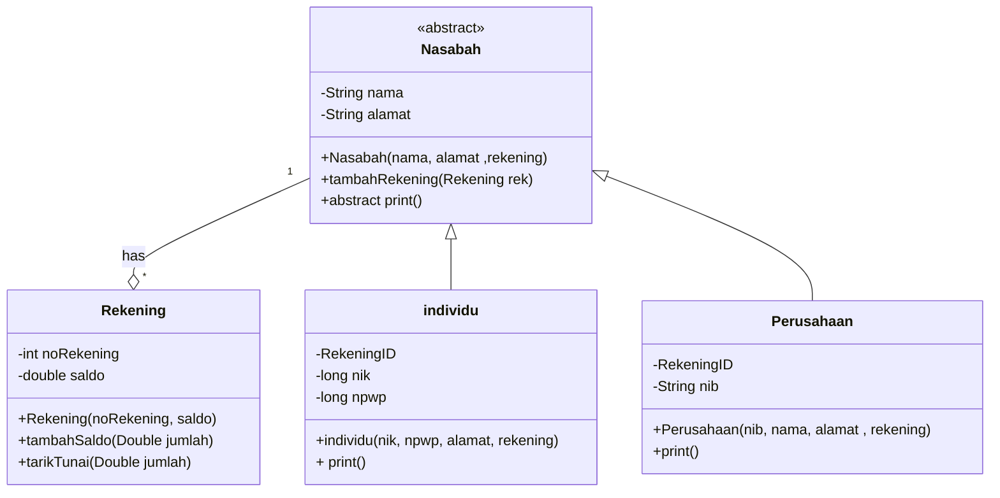
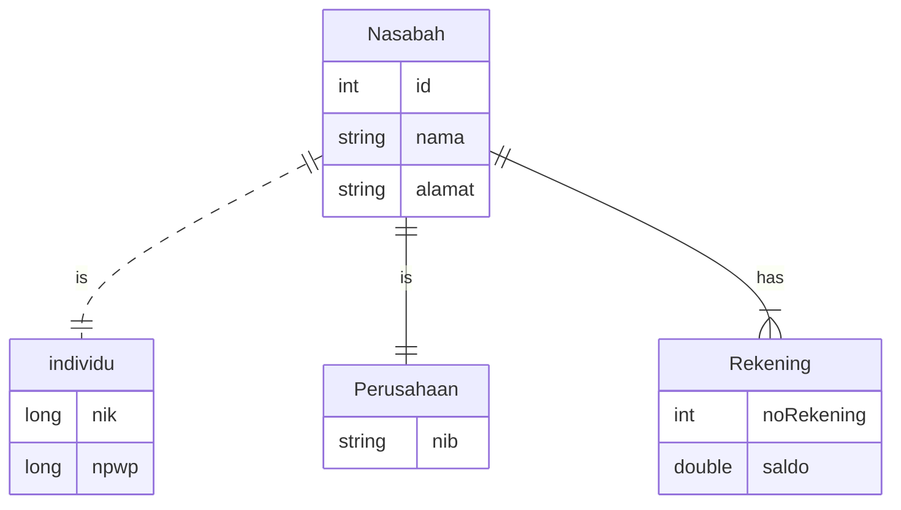
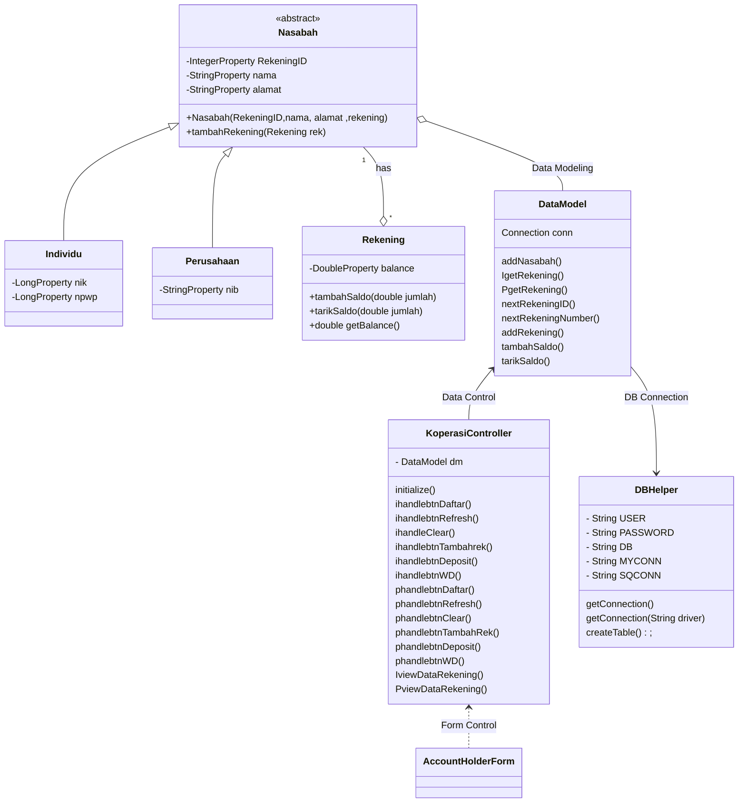

# IMPLEMENTASI UML CLASS DIAGRAM KEDALAM PROJEK JAVAFX DENGAN DATA BASE
## DESKRIPSI PROGRAM
### Program ini dapat digunakan untuk melakukan 
### transaksi perekaman atau penyimpanan data 
### pemegang akun di suatu Koperasi Simpan Pinjam, 
### dimana terdapat 2 jenis akun yaitu akun 
### individu dan akun perusahaan. Setiap Pemegang 
### Akun dapat memiliki 1 akun atau lebih. 
##  
### Program ini di rancang dengan berbagai tools, yaitu : 
* *  Netbeans 8.0.2
* *  Java 8 Oracle
* *  sqlite
* *  sqlite-jdbc-3.7.2  
* *  xampp 3.3.0 mysql
* *  mysql-connector-java-5.1.49
* *  scene builder 2.0

#

## CLASS STRUCTURE
> Agar dapat melihat class diagram di bawah terlebih dahulu download [`MERMAID`](https://www.google.com/url?sa=t&rct=j&q=&esrc=s&source=web&cd=&cad=rja&uact=8&ved=2ahUKEwiI0pbxo__yAhUDSX0KHRo9CSgQFnoECAMQAQ&url=https%3A%2F%2Fchrome.google.com%2Fwebstore%2Fdetail%2Fmermaid-diagrams%2Fphfcghedmopjadpojhmmaffjmfiakfil&usg=AOvVaw3XUo81gMc0iadYNU_ZxFRU) extension pada browser.

## ER DIAGRAM

### Design Class Diagram for JavaFX and Database

